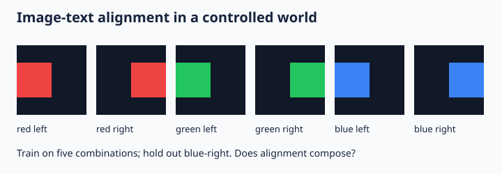

# Lecture 11 — Multimodal representations: CLIP, SigLIP, and cross-modal retrieval

[Course home](../../README.md) · Week 3, day 1 · 120 minutes

## Learning outcomes

- Derive image-text contrastive training and retrieval metrics.
- Implement a symmetric contrastive objective.
- Diagnose shortcuts and ambiguous negative pairs.

## Session plan

| Minutes | Activity |
|---|---|
| 0–10 | Retrieval quiz: recall the previous session; day 1 uses the prerequisite diagnostic |
| 10–35 | Concepts and concrete examples from the first half of these notes |
| 35–60 | Board derivation, worked example, and failure analysis |
| 60–65 | Break |
| 65–105 | Guided [notebook tutorial](../tutorials/11_contrastive.ipynb) |
| 105–115 | Practical questions in pairs, then discuss evidence |
| 115–120 | Exit ticket: one result, one limitation, one next experiment |

## Teaching notes

### Two encoders, one comparison space
A dual encoder maps images through f and text through g to vectors in a shared dimension. Normalize embeddings before comparing cosine similarity: $u=f(I)/\|f(I)\|$, $v=g(t)/\|g(t)\|$. The similarity matrix for a batch of N paired examples is $S_{ij}=u_i^\top v_j/\tau$, where temperature tau controls logit scale. Encoders may have different architectures; shared output dimension does not mean shared weights.

For a batch with one matched caption per image, image-to-text loss is $-N^{-1}\sum_i\log\frac{e^{S_{ii}}}{\sum_j e^{S_{ij}}}$. Text-to-image uses the transposed matrix. CLIP-style symmetric loss averages the two. In-batch negatives are convenient but can be false negatives: two images may both match the caption “a red square.” Multi-positive labels require a different treatment than a diagonal-only target.

### What is being learned
A vision transformer divides an image into patches, projects them, and processes patch tokens with position information. Image augmentations and caption distributions determine which invariances are learned. Contrastive alignment encourages matching, not detailed causal understanding or generative ability. A retrieval model can perform well while missing counts, relations, or small text.

SigLIP uses a pairwise sigmoid objective rather than a batch softmax normalization. SigLIP 2 is a recent case study combining multilingual representation learning with additional training objectives and data choices; use the paper to distinguish objective changes from architectural and data changes. Avoid attributing every gain to one component without ablation evidence.

### Retrieval and zero-shot classification
For image classification, encode candidate descriptions such as “a photograph of a bicycle” and choose the highest similarity. Prompt wording and label sets affect the result. Similarity-softmax values over chosen captions are not necessarily calibrated class probabilities. For retrieval, report both directions, recall@k with a declared relevant set, and performance on hard negatives.

### A small controlled world
The core lab generates colored geometric patterns as actual pixel arrays and trains a linear image projection against text-label vectors. It demonstrates alignment and compositional holdout failure; it is not a pretrained vision encoder and it does not understand natural language. Hold out one color-position combination, then inspect generalization. The optional CLIP extension runs a real pretrained dual encoder on locally generated images. Neither toy result establishes performance on natural images or African cultural contexts.

## Visual reference

Original course illustration; the notebook code is the source of measured results.

## Worked example

For N=3 and all logits zero, each row and column assigns probability 1/3, so symmetric contrastive loss is log(3)=1.0986. If two captions describe the same image equally well, forcing exactly one diagonal positive penalizes a semantically reasonable match.

## Guided tutorial

**Question:** Train a small image-to-text alignment model on generated pixel arrays and evaluate a held-out color-position combination.

Open the notebook and predict each result before running it. Spend 5 minutes on setup and data inspection, 15 on the mechanism, 10 on the controlled intervention, and 10 on interpretation. The core uses NumPy and authored/synthetic data; the notebook identifies its limits. Save outputs, configuration, and a short interpretation. Do not report an expected trend as a measured result.

**Real-model or research extension:** Run `extensions/hf_vision.py --mode clip` for actual pretrained CLIP retrieval on the supplied generated images.

See the [extension guide](../extensions/README.md) for commands, hardware assumptions, and validation status.

## Practical questions

1. Why normalize embeddings before cosine retrieval?
2. What happens when two captions in a batch are both valid for one image?
3. Can a CLIP similarity score be read as a calibrated probability?

## After class

Complete the [exercise sheet](../exercises/11_contrastive.md) in 45–60 minutes. Read the first reference's abstract and method overview before the next session; remaining references are optional depth. For long papers, focus on the objective, one figure/table, and one limitation.

## Readings

- [CLIP](https://arxiv.org/abs/2103.00020)
- [Sigmoid Loss for Language Image Pre-Training](https://arxiv.org/abs/2303.15343)
- [SigLIP 2 (2025)](https://arxiv.org/abs/2502.14786)
