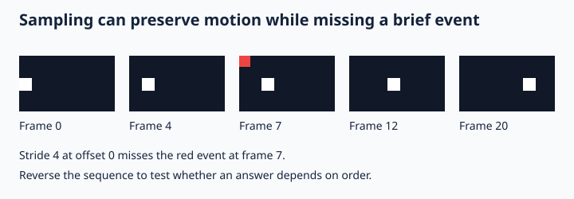

# Lecture 14 — Video, unified multimodal systems, and generative frontiers

[Course home](../../README.md) · Week 3, day 4 · 120 minutes

## Learning outcomes

- Measure how frame sampling loses brief events and ordering.
- Explain audio/video synchronization and multimodal token budgets.
- Distinguish contrastive, autoregressive, and diffusion objectives.

## Session plan

| Minutes | Activity |
|---|---|
| 0–10 | Retrieval quiz: recall the previous session; day 1 uses the prerequisite diagnostic |
| 10–35 | Concepts and concrete examples from the first half of these notes |
| 35–60 | Board derivation, worked example, and failure analysis |
| 60–65 | Break |
| 65–105 | Guided [notebook tutorial](../tutorials/14_video_omni.ipynb) |
| 105–115 | Practical questions in pairs, then discuss evidence |
| 115–120 | Exit ticket: one result, one limitation, one next experiment |

## Teaching notes

### Video adds a time axis
A sequence of images is not a bag of frames. Questions about “before,” “after,” and brief events require temporal information. Uniform sampling can miss an event between selected frames; aggressive pooling can erase order. A strong image encoder on sampled frames does not automatically understand motion. Track timestamps, sampling rate, duration, and total selected frames.

A basic pipeline decodes frames, samples them, encodes each image, adds temporal information, and conditions a language model. More integrated architectures may compress across time or jointly encode audio and video. Compare an ordered sequence with a reversed or shuffled one. If an order-sensitive answer does not change, inspect both the task and the model's temporal processing.

### Budgets and synchronization
If F frames each contribute P visual tokens, raw visual context is roughly FP before pooling and additional audio/text tokens. Long clips may exceed context or latency budgets. Audio timestamps and frame timestamps must share a reference clock. A transcript delayed by one second can attach a spoken instruction to the wrong action. Evaluate temporal localization using interval overlap as well as answer correctness.

Streaming systems must make predictions before future evidence arrives. Report time to useful response and revisions, not only offline accuracy on a completed clip. A noncausal full-video evaluation cannot establish live performance. Missing modalities should be explicit rather than silently replaced by misleading defaults.

### Unified models and current research
Qwen3.5-Omni (2026) is a reading case study for contemporary audio/video/text systems. Use its technical report to identify inputs, outputs, training stages, and reported evaluation conditions. Distinguish authors' reported results from independent replication. No large omni model is a required course download; the core principles can be tested with short controlled sequences.

### Generating media: a different objective
Autoregressive generation predicts discrete tokens sequentially. Diffusion training adds noise to data at different levels and learns a denoising function; a common objective predicts the noise with squared error. Flow matching learns a velocity field along a chosen probability path, and sampling integrates that field. These are not the same as contrastive image-text alignment. Conditioning text can guide generation, but fluent imagery does not establish physical or temporal consistency.

The lab demonstrates frame sampling and forward Gaussian noising only. It does not train a video or diffusion model. Discuss generative evaluation using text alignment, consistency, diversity, provenance, and human inspection; one similarity score cannot settle all of these. Keep scope narrow enough for a defensible three-week project.

## Visual reference

Original course illustration; the notebook code is the source of measured results.

## Worked example

A 10-second clip sampled at 2 fps gives 20 frames. At 256 tokens/frame this is 5120 visual tokens before other modalities. A 0.1-second event can fall entirely between samples. More tokens may improve coverage but increase processing cost.

## Guided tutorial

**Question:** Generate a moving-square video as pixel arrays, expose frame-sampling failures, and inspect forward Gaussian noising.

Open the notebook and predict each result before running it. Spend 5 minutes on setup and data inspection, 15 on the mechanism, 10 on the controlled intervention, and 10 on interpretation. The core uses NumPy and authored/synthetic data; the notebook identifies its limits. Save outputs, configuration, and a short interpretation. Do not report an expected trend as a measured result.

**Real-model or research extension:** Use the video-model pathway in the model-selection guide for a research extension only; freeze a short clip, frame timestamps, checkpoint revision, and generation budget before comparing systems.

See the [extension guide](../extensions/README.md) for commands, hardware assumptions, and validation status.

## Practical questions

1. Why can good single-frame accuracy coexist with poor temporal reasoning?
2. How could transcript timestamps corrupt multimodal grounding?
3. Is forward noising alone a generative diffusion model?

## After class

Complete the [exercise sheet](../exercises/14_video_omni.md) in 45–60 minutes. Read the first reference's abstract and method overview before the next session; remaining references are optional depth. For long papers, focus on the objective, one figure/table, and one limitation.

## Readings

- [Qwen3.5-Omni Technical Report (2026)](https://arxiv.org/abs/2604.15804)
- [Denoising Diffusion Probabilistic Models](https://arxiv.org/abs/2006.11239)
- [Flow Matching for Generative Modeling](https://arxiv.org/abs/2210.02747)
